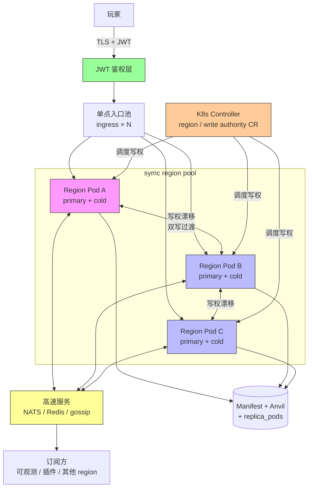
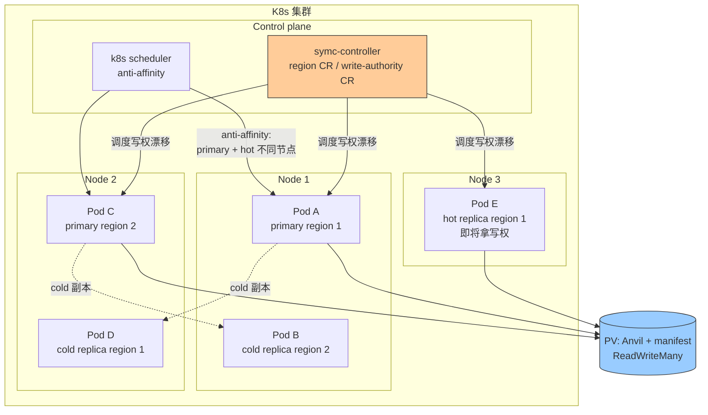
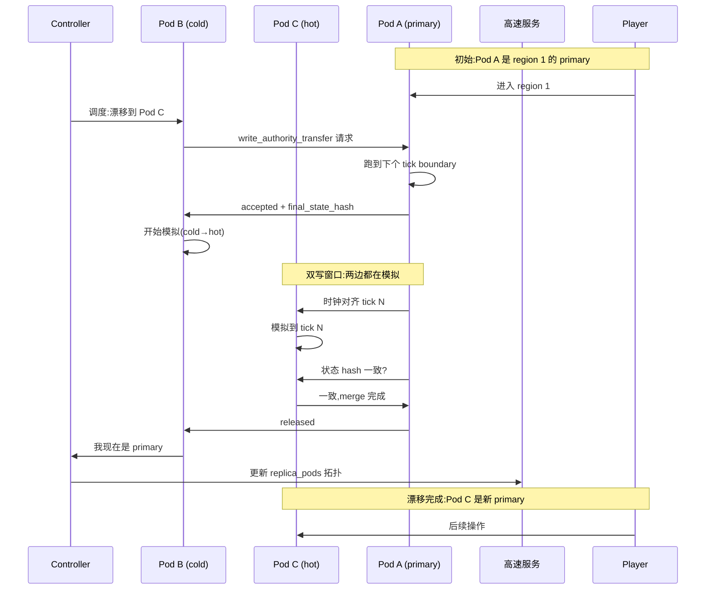
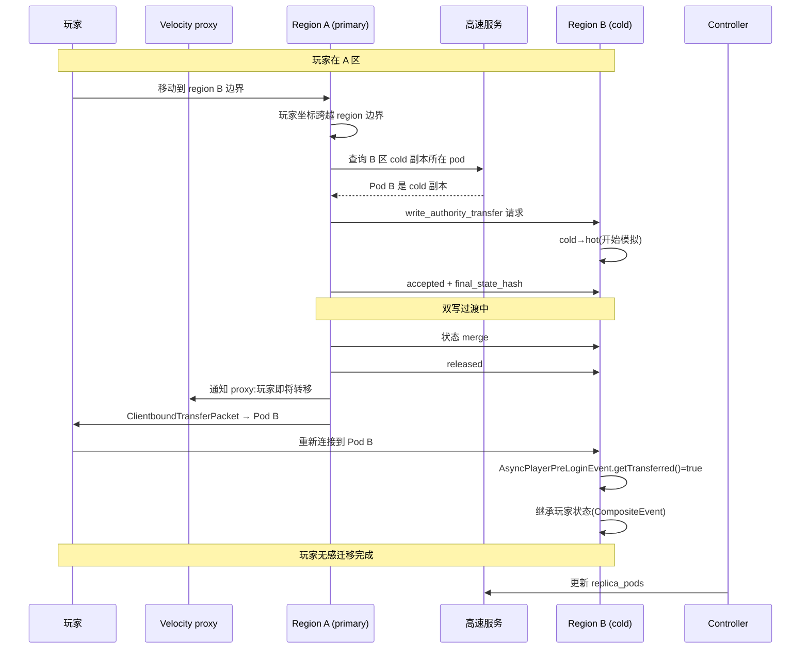
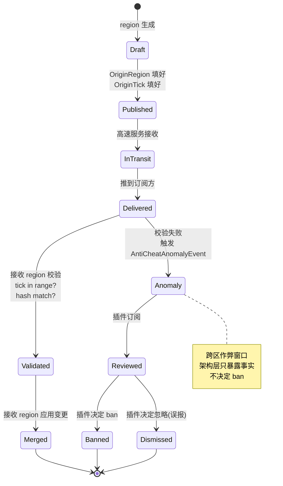
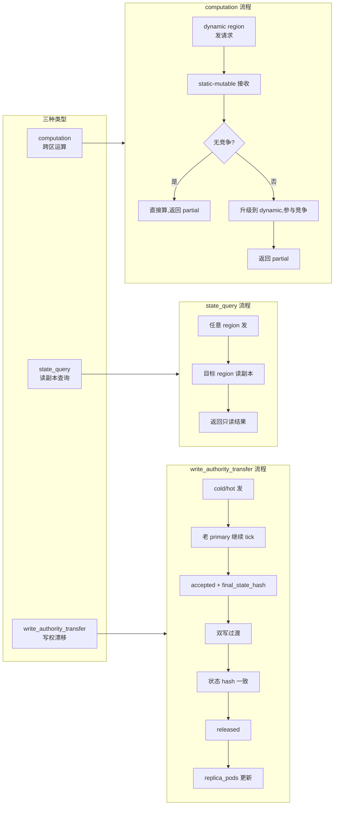
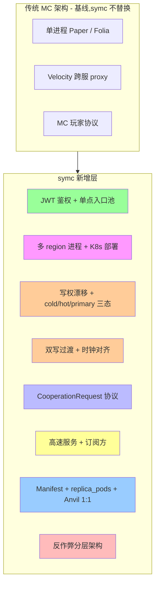
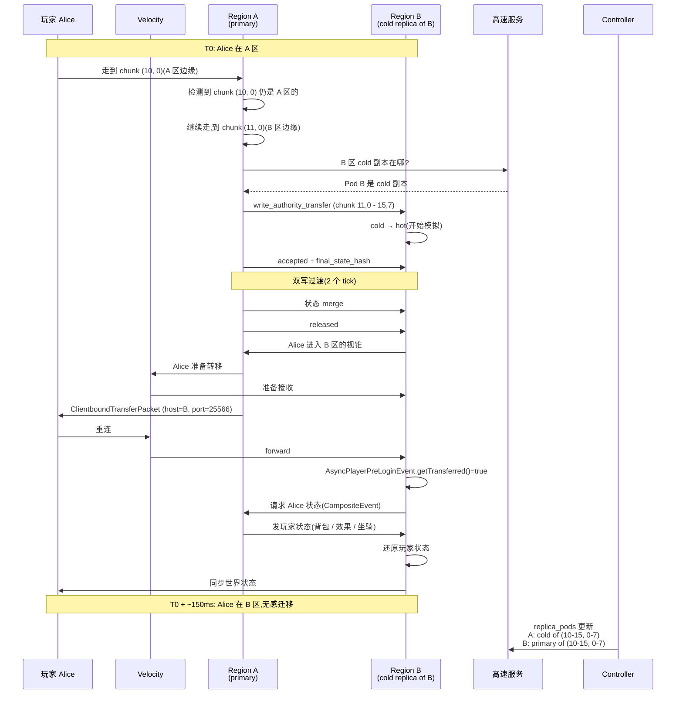
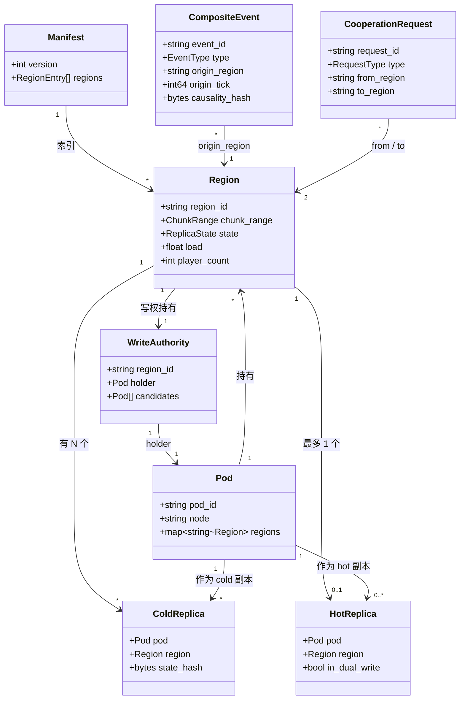

# symc — 分布式 MC 同步引擎 · 设计文档

> **状态**:v0.1 草稿 · 2026-06-20 · 配套:`README.md`(讨论稿)、`DECISIONS.md`(决策记录)、`WATCHDOG.md`(advisor 指引)

---

## §1. 项目背景

### 1.1 问题

单进程 Minecraft 服务端(典型代表 Paper)在玩家密度高、红石密集、实体数量大的场景下,CPU 和网络带宽会成为硬瓶颈。Folia 把单进程内切成多 region 并行 tick,缓解了部分 CPU 压力,但仍受单进程内存/GC/调度上限约束。Velocity/BungeeCord 解决"跨服传送"问题,但玩家跨服是显式操作,有加载画面,不属于"无感迁移"。

### 1.2 目标

把 MC 世界切成多个 region 跑在独立进程里,玩家跨区迁移**无感**(无加载画面、无卡顿),冷区可降频省 CPU/带宽。本质是把 MC 从"单进程应用"重写成"跨进程分布式系统",但保留 vanilla 的游戏行为兼容性(基于 Paper fork,不是从零写)。

### 1.3 范围与不在范围

**在范围**:跨进程 region 调度、跨区事件协议、写权漂移、副本管理、玩家跨区迁移、持久化协调、反作弊架构层事实源。

**不在范围**:客户端改动(基于 Paper + Velocity + 原生 transfer packet 协议,玩家零感知)、世界生成器(沿用 Paper 的 deterministic 生成)、反作弊 ban 决策(架构只暴露异常事件,具体 ban 交给插件)、vanilla 行为兼容层的 bug fix(交给 upstream Paper)。

---

## §2. 原始约束提炼

> 这一节是 symc 一切设计的**约束源**。后续所有决策、架构、实现路径,如果跟这里的约束冲突,以这里为准。
>
> 文本格式:自然语言段落,每条约束用编号便于引用。受众:读者(看完知道 symc 要满足什么)/ 后续 agent(看完知道要做什么)/ 验证 checklist(实现完拿每条做验收)。

### 2.1 玩家侧约束

**C1. 跨区迁移玩家无感知。** 玩家坐标跨越 region 边界时,客户端不出现加载画面、不重连、不丢游戏状态。实现路径优先采用 MC 1.21.5+ 的协议级 `ClientboundTransferPacket`(服务端发,客户端原生处理,玩家无感);次选是代理层做"客户端不知道的悄悄切换"。两种路径都要求我们**不改客户端**。

**C2. 客户端协议层对外表现为单连接。** 玩家视角里"我连了一个服务器",内部由一条主连接 + 多个维度子连接组成(1.20.2+ 传输层)。symc 不改客户端,因此"多连接"在玩家侧不可见,只在 server-side 架构里讨论——region 之间是否多连接、proxy 是否多连接,都是 server 端实现细节。

**C3. 玩家状态在跨区时原子迁移。** 玩家跨区时,背包、药水效果、坐骑、附魔属性、速度向量(死亡时还要算死亡状态)作为一个整体迁移,不拆分。分步同步会出现"背包到了 B 但药水还在 A"这种诡异状态,vanilla 玩家会立即察觉。

### 2.2 服务侧约束

**C4. region 边界可调,可拼接可拆分。** region 管理的 chunk 范围**不固定**——根据玩家密度、实体密度、计算负载,region 可被拼接(几个合成一个)、拆分(一个变几个)、扩缩 chunk 范围。region 是**逻辑状态**,不绑死某个 pod 物理位置。

**C5. region 状态可复制到其他容器。** region 的数据(状态 + 模拟结果)可以**复制**到别的容器:作为 cold 副本(只存数据、零模拟开销,玩家视锥外)或 hot 副本(在模拟但还没拿写权,双写窗口期)。容器是通用计算资源,region 写权是逻辑状态,两者解耦。

**C6. 写权漂移是常态操作,均摊负载驱动。** region 写权**频繁**在 pod 之间漂移——为均摊计算负载、应对扩缩容、做故障转移,不是罕见操作。漂移过程必须**双写过渡**,不能硬切换:硬切换会留下几十毫秒的"无人模拟"窗口,实体冻结、红石停摆,玩家会立即感知(详见 §5.2)。

### 2.3 网络与基础设施约束

**C7. 部署在 k8s 集群。** region 跑在 pod 里,Pod 是**通用计算资源**。region 写权分配走自定义 controller(类似 Kubernetes Operator + custom resource),k8s 只管 pod 生命周期,写权漂移由 controller 触发。symc 部署在 k8s 集群,不依赖裸机或虚拟机。

**C8. JWT 鉴权,落到集群内单点入口池。** 玩家连入时 JWT 鉴权,落到集群内的"单点入口池"——池里每个 ingress 都能处理玩家接入,JWT 解码后路由到合适 region pod。传输层加密(JWT 自身加密属性 + TLS)。

**C9. 事件通过低延迟总线通告,订阅方按需接收。** region 把自己世界发生的事件(chunk 更新、实体状态、玩家交互)通过一个**低延迟事件总线**通告出去;订阅方(其他 region、可观测性服务、客户端后端)自己决定接不接收,不是被动推送。延迟目标 < 10ms P99(具体校准等实验 1)。

**C10. 多入点就近接入,P99 延迟 < 50ms。** 多个 ingress 入口,玩家走最近接入点,ingress 直接 forward 到 region pod,减少 proxy hop。"直连"指 ingress → region 这一段,不指客户端 → region(客户端只连 ingress)。延迟目标 P99 < 50ms(校准后)。

**C11. 用内容同步 + 兴趣点同步覆盖跨区边界。** "边界"不是地理上的"线",而是**事件影响范围的交集**——跨多个 region 的事件需要协同处理。内容同步覆盖"状态是什么"(chunk、实体、玩家跨区事件),兴趣点同步覆盖"谁关心什么"(玩家视锥、关注点、可观测信号)。两层共同保证跨区事件不丢、不重复、不被错误地归属到某个 region。**这条约束的精确协议格式待定**——实验 2 跑出双写窗口的玩家感知阈值后,才能定 content/attention 同步的消息格式和频率。

### 2.4 实现注意(脚注/边栏)

> 这些是"实现者容易踩的坑",散在 DESIGN.md 各节脚注/边栏里。**不**单独成节。

- 写权漂移硬切换 = 50ms 玩家感知(实体冻结、红石停摆)。必须双写过渡(advisor 2026-06-20 抓的坑,详见 §5.2)
- 双写期间冲突分三类:可自动合并 / 需仲裁 / 不可合并(详见 §5.2)
- 反作弊是分层责任:基线(谁说了算)+ 检测(怎么发现)+ 运营(怎么处置),不分层就会混(详见 §5.4)
- 反作弊 CompositeEvent 三个字段(OriginRegion / OriginTick / CausalityHash)是 O(1) 哈希比对,不增加延迟(详见 §5.4)
- Paper 26.1.2 已实现 `ClientboundTransferPacket`,**不要**自己写黑盒转发(详见 §5.3)
- 玩家状态(背包/效果/坐骑)跨区迁移走 CompositeEvent 发,目标 region 接收后还原(详见 §5.3)

---

## §3. 核心抽象

### 3.1 Cell

`Cell = (chunk_x, chunk_z, tick, time_window)` 是 symc 的**原子处理单元**。三要素**不能拆**:
- 拆 tick:同一动作的两个 tick 被分开处理,顺序会乱,红石会坏
- 拆 chunk:一个动作跨两个 chunk,只处理一半,边界会坏
- 拆 time:预测和回滚会错

默认 `time_window = 50ms`(对齐一个 MC tick),允许 1× / 2× / 20× 档位(50ms / 100ms / 1s)。

### 3.2 Layer(离散档位 + 连续温度场)

**离散档位**(保留,作为操作桶):

- **Static** — 几乎不变(地形、光照、生物群系)
- **Semi-static** — 平时不动,事件触发可升级(休眠红石、空漏斗链、睡觉的动物)
- **Dynamic** — 必须 20 tick 跑满(玩家移动、战斗、掉落物、活跃红石、怪物 AI)
- **Ephemeral** — 可丢(粒子、声音、远处实体粗略位置)

**连续温度场**(用户 @steaven 2026-06-20 提议):

每个 Cell 有连续温度 T ∈ [0, 1],三个因子归约:

- `player_proximity` — 玩家距 chunk 距离 / 视锥半径 → 归一化
- `redstone_activity` — 红石变更率 / 最大变更率
- `entity_density` — 生物 + 物品 + 投射物数 → 归一化

归约函数(初版):

```
T = tanh(w₁ · player_proximity + w₂ · redstone_activity + w₃ · entity_density)
```

初始权重 `w₁ = w₂ = w₃ = 1.0`,**待实验 2 校准**。

**hysteresis 滞后带**:升温阈值 0.6 → 升 Dynamic;降温阈值 0.4 → 降 Semi-static。**温变率限幅 ±0.2/s**——避免单次红石脉冲导致整片 chunk 跳到 Dynamic。

**采样稀疏**:只算被订阅 / 视锥内 chunk,其他 chunk 温度 = 上次值 × 0.9/tick 衰减(避免无界次计算)。

**温度 vs Layer 关系**:温度是底层连续信号,Layer 是温度划分的**操作桶**。调度器用 T 做 fine-grained 控制,Layer 做 fallback(给插件 / 反作弊等需要离散语义的下游用)。

升降级规则详见 §5.1.1(温度场扩展)。

### 3.3 Weight

每个 Cell 在不同 Layer 下有一个权重,决定本 tick 是否优先处理。详细公式见 §5.1。

### 3.4 Region

region 是 symc 的**逻辑调度单元**:
- 负责一片 chunk 范围(动态可调)
- 写权属于一个 pod(可漂移)
- 包含零个或多个 cold 副本
- 通过 CooperationRequest 跟其他 region 协作

详见 §5.2。

### 3.5 CompositeEvent

跨区事件抽象,包含多个 region 共同关心的状态变更。三个核心字段(详见 §5.4):`OriginRegion` / `OriginTick` / `CausalityHash`。

### 3.6 CooperationRequest

region 间协作协议,三种类型(详见 §5.6):
- `computation` — 跨区运算协作
- `state_query` — 读副本查询
- `write_authority_transfer` — 写权漂移

---

## §4. 架构总览(8 张 mermaid 图)

> 这一节是 symc 的"一眼看懂"——8 张图覆盖系统组件、K8s 部署、写权漂移时序、玩家跨区时序、CompositeEvent 状态机、CooperationRequest 流程、symc 加了什么、状态变迁示例。

### 4.1 系统组件核心架构图



### 4.2 K8s 部署图



### 4.3 写权漂移时序图(cold → hot → primary)



### 4.4 玩家跨区时序图(transfer + cold→hot 联动)



### 4.5 CompositeEvent 状态机



### 4.6 CooperationRequest 交互流程图



### 4.7 symc 加了什么(对比传统 MC 架构)



### 4.8 状态变迁示例(具体场景:玩家从 A 区走到 B 区)



---

## §5. 决策

> 决策详细记录在 `DECISIONS.md`。这里是设计文档视角的**精炼版**——每条决策给"做了什么 + 为什么 + 跟其他决策的关系"。

### 5.1 D1 — Weight 公式(门控 + 精排)

**做什么**:
- Load / NetworkCost / Consistency 三个因子做**门控规则**(不进分数)
- 剩下 3 个变量(Urgency / Impact / RegionCount)进 tanh 归一化:`W = tanh((U × I × R) × α)`,`R = 1 + 0.3 × (RegionCount - 1)`,`α = 1.0`
- BatchGain / SplitPenalty 不进 W,做二元判断(能合就合,不能合单独走 fast lane)

**为什么**:8 个因子强行加权是控制论套到离散分类上的错觉。MC 事件本质离散(4 层 Layer),用连续标量拟合只会出来调不动的公式。结构对了,3 个真实变量就够。

**门控规则**:
- `Load > 0.8` → cell 强制降级到 Semi-static,本 tick 不进精排
- `NetworkCost > 0.5` → cell 进 Batch 队列,等下个 tick
- Consistency 离散档位:strict (0ms) / eventual (100ms) / best_effort (可丢)

**调度解释**:
| W 范围 | 处理 |
|---|---|
| > 0.7 | fast sync,触发 tick 对齐 |
| 0.4 ~ 0.7 | 主 region 权威,其他 region 按需接收 |
| 0.1 ~ 0.4 | 允许延迟,Batch 队列 |

### 5.1.1 温度场扩展(D1 v2,2026-06-20)

**dual gate 双门控**(2026-06-20):温度场 + AgentLoad 信号两路独立计算,任一触发即降级。

- **温度场门控**:`T < 0.4` → 降级至 Semi-static;`T < 0.1` → 仅 Ephemeral 允许丢弃
- **AgentLoad 门控**:`Load > 0.8` → 降级至 Semi-static(Load 来源:pod CPU% / chunk + pending 任务队列长度)
- 两路并行计算,**任一先报即降**;双路冗余避免单点漏判(纯静态负载无 T 信号 / 纯玩家密集无 Load 信号,各自走对方漏掉的那一类)
- 触发后的恢复也走 dual:两路都低于阈值才升级(避免抖动)

**W × T 联合决策**:

`W`(事件紧急度)和 `T`(chunk 热力)是两个独立 [0, 1] 信号,**不合并**:

- `W` 决定"事件本身要不要优先"
- `T` 决定"chunk 要不要多跑几 tick"

调度器联合查表:

| W \ T | 高 T (> 0.6) | 低 T (< 0.4) |
|---|---|---|
| **高 W (> 0.7)** | fast sync | 主 region 权威 |
| **低 W (< 0.4)** | Batch 队列 | 允许延迟 |

**梯度预测预热**:

- 计算 `dT/dt`(温度导数)
- `dT/dt > 0.1/tick` → 预测将在 N tick 内升温至 Dynamic → 提前触发 cold→hot 写权漂移
- 跟 D2 联动:预热让写权转移在玩家真正进入 Dynamic 前完成,消除感知延迟

**实验 2 校准项**:

- `w₁ / w₂ / w₃` 三个归约权重(初版 1.0)
- hysteresis 带宽(0.6 / 0.4 是否最优)
- 衰减系数(0.9/tick 是否合适)
- `dT/dt` 预热阈值(0.1/tick 是否敏感/迟滞)

**跟原 D1 公式的关系**:门控从"单一 Load 因子"升级为"dual gate 双门控"(温度场 + AgentLoad);两路独立信号相互兜底,既保留原 D1 的负载门控语义,又引入温度场对"玩家 / 红石活跃度"敏感的细粒度控制。详见本节"dual gate 双门控"段。

### 5.2 D2 — 边界 chunk(单写权 + cold/hot + 双写过渡)

**做什么**:chunk 写权属于一个 region(逻辑概念,不绑死 pod),同一 chunk 可有 N 个 cold 副本(只存数据,零模拟)和 0-1 个 hot 副本(在模拟但没写权)。玩家视锥进入时 cold→hot 走双写过渡。

**副本三态**:

| 状态 | 含义 | 模拟? | 写权? |
|---|---|---|---|
| primary | 当前模拟 chunk,有写权 | 是 | 是 |
| hot 副本 | 在模拟,还没拿写权(双写窗口) | 是 | 否 |
| cold 副本 | 只存数据,零模拟 | 否 | 否 |

**写权漂移流程**(双写过渡,**不**硬切):
1. 漂移开始:目标 pod 把 cold 副本提升为 hot,开始模拟
2. 老 pod 继续模拟(它还是 primary)
3. 时钟对齐 + 状态同步:两方按共享时钟基线 merge
4. 收敛:老 pod 释放写权,新 pod 拿写权(变 primary),老 pod 的 hot 可选降 cold
5. 漂移完成:1 primary + 1 hot(原 primary)+ N cold

**为什么**:MC 的"加载 chunk"会触发实体 tick / 随机 tick / 红石更新,这些都是写。所以"只读副本"在玩家视锥进入时必须变 hot。硬切换 50ms 玩家感知——双写过渡靠时钟对齐消解。

**双写期间冲突类型分布**(advisor 2026-06-20 加):
- **可自动合并**:双方操作不互斥(不同方块)→ LWW / set union
- **需仲裁**:操作互斥但都"合法"(玩家 A 打破 vs 玩家 B 放同一坐标)→ 仲裁协议(选先到者)
- **不可合并**:操作互斥且语义冲突(玩家 A 传送 vs 玩家 B 把 A 拉回)→ 标记异常,触发反作弊

**k8s 联动**:Pod 是通用计算资源,region 写权通过自定义 controller 分配。

### 5.2.1 缓冲带(Buffer Zone,2026-06-20 用户 @steaven 提议)

region 边界两侧各 N chunk 宽设为**缓冲带**。**P4 已跑**(2026-06-20,详见 docs/exp-bufferzone.md):**N=1 是性价比拐点**(CompositeEvent 减少 76%,算力 +25%),**N=2 完全消除 events(+50% 算力税)**。**默认 N=1**,**必须零跨区**场景用 N=2。

**写权归属**:缓冲带内 chunk 写权仍属**主 region**(跟非缓冲 chunk 一样)。邻居 region 可持有 cold 副本(存储)或 hot 副本(双写窗口),但**不共享写权**。

**机制**:

- 缓冲带内的红石脉冲、水流、怪物 AI 跨边界时,两边 region 都有上下文 → 减少 CompositeEvent 数量
- 邻居 region 对缓冲带 chunk 的模拟结果是**校验版**(与主 region 权威版对比),差异过大 → 触发仲裁
- 缓冲带的冲突天然倾向"可自动合并"(两边状态应该几乎一致)

**与 cold→hot 漂移的联动**:

- 玩家接近 region 边界 → §5.1.1 的 `dT/dt` 梯度预测触发预热
- 预热 = 邻居 region 先把缓冲带内的 cold 副本提升为 hot,开始双写过渡
- 玩家真正跨区时写权已转完 → 无感知

**算力成本**:

- 缓冲带内每个 chunk 多一个 hot 副本模拟 → 2× 算力
- 实际开销取决于边界长度和缓冲带宽度(实验 2 测)
- §11 风险表列"缓冲带算力税"

**实验 2 测量**:

- 缓冲带宽度 N 对 CompositeEvent 减少量的影响
- 缓冲带模拟成本(CPU% / chunk)vs 收益(玩家跨区感知延迟减少量)

### 5.3 D3 — 玩家跨区(proxy + transfer packet)

**做什么**:每个 region 是独立 Paper 进程,`accepts-transfers=true`。Velocity 作 proxy,知道 region ↔ chunk range 映射(从中央 scheduler 同步)。玩家跨区时主 region 调 `PaperCommonConnection#transfer(host, port)`,客户端走原生 `ClientboundTransferPacket`,**不踢客户端、不重连、状态带过去**。

**实现要点**:
- 玩家跨区判定在主 region 端(玩家坐标跨越 region 边界),调 `transfer()` 发到目标 region
- 目标 region 的 `AsyncPlayerPreLoginEvent.getTransferred() = true` → 走 transfer 初始化路径
- 玩家状态(背包/效果/坐骑)走 CompositeEvent 发,目标 region 还原

**与 D2 v3 联动**:玩家跨区 = transfer packet(D3) + cold→hot 双写过渡(D2)。新 region 通过 `write_authority_transfer` 协议从 cold 升级为 hot,transfer packet 把连接切到新 region 进程。**两个机制都要**。

### 5.4 D4 — 反作弊(基线 + 覆盖层)

**做什么**:分层,各管一摊:
- **基线** = 谁说了算 — 主 region 对自己 chunk 物理有最终权威(vanilla 一致),邻居 region 偶尔抽查
- **覆盖层** = 怎么发现跨区作弊 — CompositeEvent 带时间戳 + 因果元数据,架构暴露 `AntiCheatAnomalyEvent` 给插件订阅
- **运营层** = 怎么处置 — 不归架构管,交给反作弊插件(ban / kick / log)

**为什么分层**:选项 1(全联署)2×RTT 玩家感知到卡顿,选项 3(交给插件)放弃架构责任(现有插件在单服假设下工作,跨区作弊窗口看不见)。**基线 + 覆盖层**两个不同问题,组合解。

**CompositeEvent 三个字段**:

| 字段 | 类型 | 含义 |
|---|---|---|
| `OriginRegion` | region ID | 事件发起的 region |
| `OriginTick` | tick 序号 | 发起时的 tick |
| `CausalityHash` | 哈希 | 该事件依赖的前置状态指纹 |

**接收 region 校验**(O(1) 哈希比对,**不**增加延迟):
1. `OriginTick` 在已知 causal history 内?
2. `CausalityHash` 匹配当前已知状态?

任一不通过 → 触发 `AntiCheatAnomalyEvent`,插件订阅决定处置。

### 5.5 D5 — 多 region 存读(Anvil 1:1 + manifest + replica_pods)

**做什么**:MC Anvil 区域文件(`.mca`)是按 region 切的(8×8 chunk 一个 region file)——跟我们 region 概念同构,直接 1:1 映射。每个 region 并行写自己的 `.mca`,完成后更新 manifest,commit = manifest 写盘 + fsync。

**manifest 字段**:

| 字段 | 类型 | 含义 |
|---|---|---|
| `region_id` | string | 唯一 ID |
| `chunk_range` | (x, z, dx, dz) | 区域 chunk 范围(动态范围化) |
| `mtime` | int64 | 上次 commit 时间 |
| `version` | int64 | manifest 版本号(commit 递增) |
| `replica_pods` | [string] | **advisor 2026-06-20 加的**:哪些 pod 持有 cold 副本(写权漂移候选) |

**读时一致性**:加载世界读 manifest,按 region 列表拉对应 pod。某 region 缺失 = 部分世界加载(MC 已处理)。`replica_pods` 让 pod 故障时快速找替代副本。

### 5.6 D-extra — CooperationRequest 协议

**三种类型**:

| 类型 | 用途 | 触发方 | 接收方 | 时延要求 |
|---|---|---|---|---|
| `computation` | 跨区运算协作 | dynamic region | static-mutable region | 中(可等) |
| `state_query` | 读副本查询(只读,不申请写权) | 任何 region | 任何 region | 低 |
| `write_authority_transfer` | 写权漂移 — cold/hot 申请拿写权 | cold/hot region | 当前 primary | **低**(玩家视锥进入时触发) |

**`write_authority_transfer` 协议字段**:
- request: `{from_region, to_region, chunk_range, current_tick, target_state_hash}`
- response: `{accepted, final_state_hash, transfer_tick, causality_hash}`

**流程**(双写过渡版,**不**硬切):
1. cold region 收到"玩家视锥进入"信号 → 发 `write_authority_transfer` 请求
2. 老 primary 继续模拟到下个 tick boundary
3. 老 primary 发 `accepted` + `final_state_hash`
4. cold → hot(开始模拟,跟老 primary 同步跑)
5. 双方按共享时钟基线 merge,直到 next state hash 一致
6. 老 primary 发 `released` → 目标 region 变 primary,老 primary 降级 hot(可选降 cold)
7. 漂移完成,`replica_pods` 同步更新

**限流**:写权转移请求按 chunk 范围做限流 — 同一 chunk 范围每秒最多 1 次漂移(避免抖动)。

---

## §6. 技术概览

### 6.1 高速服务选型

**M1 in-process baseline 已跑**(2026-06-20):P50=0ns,P99=0.56ms(单 sender),conc=10/100 P99=0ns(scheduler 优化,无 GC 抖动)。in-process channel 延迟纳秒级——这是"延迟理论下限"。真实总线(NATS/Redis/gossip)加上去后的额外延迟 = 真实值 - baseline。目标 &lt;10ms,留 18× 余量。三种候选:

**M1 已跑**(2026-06-20):
- In-process baseline: P50=0ns P99=0.56ms — §6.1 目标 &lt;10ms 留 18× 余量
- NATS(真实 TCP): P50=504μs P99=874μs(64B) / P99=31.9ms(64KB ⚠️ 超目标)
- Redis(miniredis): P50=172μs P99=847μs(64KB) — 大 payload 快 NATS 37.7×
- **推荐 Redis Streams** 作为高速服务优先候选(NATS 仅在需要 JetStream 持久化时备选)
- 完整对比见 docs/exp1-bus-nats.md + docs/exp1-bus-redis.md + results/
- **64KB P50=2.7ms, P99=31.9ms ❌**(超过 10ms 目标 3.2×)

**结论**:NATS 适合 ≤4KB 消息(强推荐);64KB+ 需拆分或换总线(gRPC + protobuf?自研 TCP?)。Redis Streams 与自研 TCP 同 benchmark 待跑。

**决策标准**:P50/P99 延迟、带宽、运维复杂度、跟 K8s 集成的便利度。

### 6.2 K8s controller 设计

- 写权漂移调度走**自定义 controller**(类似 Kubernetes Operator + custom resource)
- Region CR / WriteAuthority CR 定义
- Pod 候选优先选 `replica_pods` 里的 hot 副本(免去 cold→hot 升级),其次 cold 副本升级
- Anti-affinity 规则:同一 region 的 primary 和 hot 副本不在同一节点

### 6.3 JWT 鉴权流程

**设计原则**:JWT 是**鉴权凭证**,不是状态容器。玩家状态(背包 / 效果 / 坐骑)由 region 维护,**不**塞进 JWT。

**JWT 载荷**(`claims`):
- `sub` — 玩家 UUID(全球唯一)
- `name` — 玩家名
- `exp` / `iat` — 标准时间戳
- `iss` — symc 控制面(controller 签发)
- `aud` — 目标集群 ID
- `region_hint` — 可选,controller 推荐落地的 region(可被覆盖)

**流程**:

1. 玩家从 launcher 拿到 JWT(launcher 先跟 controller 走 OAuth / 账号密码换 JWT)
2. 玩家用 JWT 连接到最近 ingress(地理就近,详见 §6.4)
3. Ingress 验证 JWT 签名 + `exp` + `aud` + 是否在吊销列表
4. Ingress 查询 controller:`这个玩家上次在哪个 region?`(可选,无状态玩家就是新会话)
5. Controller 返回目标 region pod 的 host:port
6. Ingress forward 玩家到 region pod(可选:sticker 路由 / 直接 forward)
7. Region pod 的 `AsyncPlayerPreLoginEvent` 接收,加载玩家状态(本地缓存 / 从其他 region 拉)

**撤销机制**:JWT 短有效期(默认 1 小时),过期需重新换。`exp` 校验 + controller 端吊销列表(可选)。

**传输加密**:TLS 1.3 强制(JWT 自身不加密载荷,只签 payload 不泄露 secret)。Region pod ↔ ingress 之间是 k8s 内网,但仍走 mTLS(零信任)。

**为什么不直接塞玩家状态进 JWT**:
- 状态可能很大(背包几十 KB 起)
- 状态需要实时更新,改了就要重发 JWT,延迟差
- 状态跟 region 耦合,JWT 是跨 region 凭证,职责要分清

### 6.4 多 ingress 就近接入

**拓扑**:
- K8s cluster 内部署 N 个 ingress pod(`Deployment`,无状态)
- 每个 ingress pod 在地理上靠近玩家:同机房 / 同可用区 / 同地域
- Service 用 `LoadBalancer` 或 `NodePort` 暴露,公网 DNS 用 geolocation 解析

**就近接入策略**:
1. 玩家 DNS 查询 `play.symc.example.com` → 解析到最近的 ingress IP(geo DNS / Anycast)
2. 玩家 TCP 连最近的 ingress
3. Ingress 拿到 JWT,验证后查 controller 拿目标 region
4. Ingress forward 到 region pod(同 cluster 内,k8s service / cluster IP)

**为什么不是客户端 → region 直连**:
- 客户端不知道 region 拓扑(玩家不该知道)
- region pod 漂移后 IP 变,客户端要重新解析 → 破坏单连接体验
- Ingress 承担"哪个人连哪个 pod"的路由决策,客户端无需关心

**延迟优化**:
- Ingress 用 eBPF / kernel bypass 转发(目标 < 1ms 加 latency)
- Region pod 跟 ingress 同节点 / 同可用区优先调度
- 长连接 keepalive(避免 TCP 重连开销)

**故障转移**:Ingress pod 死了 → k8s 重新拉一个 → 公网 IP 不变(LoadBalancer 调度)→ 玩家重连到同 IP 即可。

### 6.5 Paper 26.1.2 transfer packet 集成点

`paper-api/.../PlayerCommonConnection.java#transfer(host, port)` API
`paper-server/.../PaperCommonConnection.java` 发 `ClientboundTransferPacket`
服务端配置 `accepts-transfers=true`
`AsyncPlayerPreLoginEvent.getTransferred()` 检测 transfer 连接

### 6.6 持久化与 Anvil 区域文件

详见 §5.5。

---

## §7. 实现路径(milestone)

实现按以下顺序,**前一个 milestone 没过验收不进下一个**。每个 milestone 有明确输入、输出、验收标准。

### M0 — 基础骨架(已完成)

- **输入**:无
- **输出**:
  - Go sim 骨架:`cmd/sim/`, `pkg/{cell,layer,weight,affinity,scheduler,packet,sync}/`
  - `go.mod` 初始化 `github.com/symc/sim`
  - Paper 26.1.2 浅克隆在 `Paper/`
  - `.gradle-env.ps1` 隔离 Gradle 缓存到 D 盘
  - `README.md` / `DECISIONS.md` / `WATCHDOG.md` / `DESIGN.md` 四份文档
- **验收**:`go run ./cmd/sim` 跑出 "symc sim: cell=... layer=... weight=..." 单行输出
- **状态**:✅ 已完成

### M1 — 实验 1:事件总线延迟基线

- **输入**:M0 骨架
- **输出**:
  - Go 实验程序 `cmd/exp1-bus/`,跑三种候选(自研 TCP / NATS / Redis)
  - 同节点 / 跨节点、64B / 1KB / 64KB 三种事件大小、1/10/100 三种并发订阅的 P50/P99 数字
  - 选型推荐(NATS vs Redis vs 自研)
- **验收**:数字 + 推荐方案,有 README
- **依赖**:D2 目录有 NATS server / Redis 二进制(见 §9.3)

### M2 — 实验 2:写权漂移双写过渡

- **输入**:M1 选型 + M0 骨架
- **输出**:
  - Go 实验程序 `cmd/exp2-drift/`
  - 5 个核心测量结果:双写窗口长度 / 冲突率 / 冲突类型分布 / 时钟对齐误差 / 玩家感知阈值
  - 1000 玩家场景模拟(advisor 2026-06-20 合并实验 4)
- **验收**:每个测量项有 P50/P99 数字,玩家感知阈值有 < 多少 ms 玩家不卡的结论

### M3 — 实验 3:读副本 broadcast 带宽

- **输入**:M2 双写窗口数字
- **输出**:`cmd/exp3-replica/`,N=1/4/16/64 下的 broadcast 带宽数字
- **验收**:**读副本数量上限**——给出"N 超过多少改成按需拉"的推荐值

### M4 — 实验 4:反作弊因果校验开销

- **输入**:M1-M3 数字
- **输出**:`cmd/exp4-anticheat/`,CausalityHash 长度 8/16/32B + 事件频率 100/1000/10000/tick 下的带宽 + 碰撞率
- **验收**:**带宽成本数字 + 推荐的 CausalityHash 长度**

### M5 — Paper fork 准备

- **输入**:M4 数字 + 用户准备 JDK 25
- **输出**:
  - JDK 25 安装 + JAVA_HOME 配置
  - `cd Paper && . ../../.gradle-env.ps1 && .\gradlew.bat applyPatches` 跑通
  - 浅克隆升级为 fork(添加 remote + 建 dev 分支)
  - `paper-server/build/libs/` 有 paperclip jar
- **验收**:能跑 Paper 自带的测试服务器

### M5.5 — 温度场 sim 跑通(2026-06-20,§3.2 + §5.1.1 前置)

- **输入**:M0 Go sim 骨架 + §3.2 温度场定义
- **输出**:
  - `cmd/exp-tempfield/`:Go sim 跑通温度场
  - 三个归约因子 `player_proximity` / `redstone_activity` / `entity_density` 真实输入(从 MC world state 抽)
  - 验证 tanh 归约 + hysteresis 滞后带 + 温变率限幅 ±0.2/s 行为符合预期
  - 输出每 chunk 温度时间序列,画图(ASCII / PNG)
- **验收**:
  - 静态 chunk 温度稳定在 0.1 附近(无人)
  - 玩家走进 chunk 温度在 5 tick 内升到 0.7
  - 玩家离开后温度 0.9/tick 衰减(2-3 tick 回 0.1)
  - 红石脉冲不会让温度瞬跳(温变率限幅生效)
- **依赖**:M0 + §3.2 温度场定义;**M5.5 必须在 M6 Paper 集成前完成**,否则 M6 写权漂移无法用温度梯度预测

### M6 — Paper 集成:write_authority_transfer hook

- **输入**:M5 + D-extra 协议字段定义(§8.3)
- **输出**:
  - Paper 源码加 `write_authority_transfer` 请求处理 hook
  - 加 cold/hot/primary 三态的 chunk 副本管理
  - 双写过渡逻辑(从 §5.2 流程)
- **验收**:Paper 测试能模拟 cold→hot→primary 漂移,无玩家感知

### M7 — K8s controller 实现

- **输入**:M6 + §8.4 CRD 定义
- **输出**:
  - Region CRD / WriteAuthority CRD
  - symc-controller(Go,Operator SDK)
  - Anti-affinity 规则
  - 写权漂移调度逻辑
- **验收**:controller 能在 minikube / kind 上跑 demo,调度写权漂移

### M8 — 端到端集成测试

- **输入**:M7 + Velocity
- **输出**:
  - 2 region 集成测试:玩家从 region 1 走到 region 2,无感迁移
  - Performance 跑分(玩家数 vs 延迟 vs 带宽)
  - 故障注入测试(region pod 死了,玩家自动转走)
- **验收**:能跑 demo,关键指标达标(详见 §11)

### M9 — 性能调优 + advisor 复审

- **输入**:M8 跑分
- **输出**:
  - 调优后的参数(α、门控阈值、双写窗口长度、cooldown 等)
  - 完整复审(整套 advisor 再走一遍)
  - 准备 1.0 release tag

---

## §8. 具体实现内容

### 8.1 Go sim 包结构

```
cmd/
  sim/                 # 入口(已实现)
  exp1-bus/            # 实验 1(M1)
  exp2-drift/          # 实验 2(M2)
  exp3-replica/        # 实验 3(M3)
  exp4-anticheat/      # 实验 4(M4)
pkg/
  cell/                # Cell 定义(已实现)
  layer/               # Layer 分级(已实现,4 层 + 升降级规则见 §5.1)
  weight/              # Weight 公式(已实现初版,门控 + tanh 精排见 §5.1)
  affinity/            # 邻近 cell 聚类(stub,scheduler 调用时填)
  scheduler/           # tick budget 分配(stub)
  packet/              # 切片(stub)
  sync/                # CooperationRequest 实现(stub,D-extra 协议 §5.6 实现)
  replica/             # cold/hot/primary 三态管理(M6 阶段填)
  transfer/            # write_authority_transfer 协议实现(M6 阶段填)
  manifest/            # manifest 读写 + replica_pods 维护(M5+ 阶段填)
internal/
  clock/               # 共享时钟基线(NTP / 自研)
  bus/                 # 高速服务 client(选型后填)
  experiment/          # 实验公共工具(stat / percentiles / 报告生成)
```

### 8.2 Paper fork 改动点

**已存在的 API(直接用)**:
- `paper-api/.../PlayerCommonConnection.java#transfer(String host, int port)`
- `paper-server/.../PaperCommonConnection.java#send(ClientboundTransferPacket)`
- `AsyncPlayerPreLoginEvent#getTransferred()` / `setTransferred(boolean)`

**需要加的 hook / patch**:

| 位置 | 改动 |
|---|---|
| `ChunkMap.java` | 加 chunk 的 `ReplicaState`(primary/hot/cold)字段 |
| `ServerLevel.java` | 在 chunk load 时检查是否需要写权漂移 |
| `MinecraftServer.java` | 加 `symc.TransferRequestHandler`(接收 transfer 并初始化) |
| `PlayerList.java` | 加 `AsyncPlayerPreLoginEvent` 的 transfer 状态继承 |
| 新文件 `SymcColdReplica.java` | 管理 cold 副本的加载 / 卸载 / 同步 |
| 新文件 `SymcWriteAuthorityManager.java` | 写权漂移的发起 / 接受 / 状态机 |
| 新文件 `SymcAntiCheatHook.java` | CompositeEvent 校验 + AntiCheatAnomalyEvent 触发 |
| 新文件 `SymcCooperationRequest.java` | 三种 CooperationRequest 类型实现 |
| 配置 `config/symc.toml` | `accepts-transfers=true` / `write-authority-enabled` / 等 |

**注意**:
- Paper 浅克隆要升级为 fork(添加 GitHub remote + 建 dev 分支)
- Patch 文件要进 `Paper/patches/`(paperweight 框架),不能直接改 `paper-server/src/`
- 每次 Paper upstream 更新要重新 applyPatches

### 8.3 协议字段定义

#### CompositeEvent

```protobuf
message CompositeEvent {
  string event_id = 1;             // 唯一 ID(UUID v7)
  EventType type = 2;              // 玩家跨区 / 红石跨区 / 水流跨区 / 实体迁移 ...
  repeated string cells = 3;       // 涉及的 (chunk, tick, time_window) 编码
  repeated string regions = 4;     // 涉及的 region ID
  float weight = 5;                // 整体权重(D1 算出)
  Consistency consistency = 6;     // strict / eventual / best_effort
  repeated PartialResult partials = 7; // 各 region 贡献的 partial result

  // D4 反作弊三字段
  string origin_region = 8;        // OriginRegion:发起 region
  int64 origin_tick = 9;           // OriginTick:发起 tick
  bytes causality_hash = 10;       // CausalityHash:前置状态指纹(16B 默认)
}

enum EventType {
  PLAYER_CROSS_REGION = 0;
  REDSTONE_CROSS_REGION = 1;
  FLUID_CROSS_REGION = 2;
  ENTITY_MIGRATION = 3;
  PLAYER_STATE_TRANSFER = 4;
}

enum Consistency {
  STRICT = 0;
  EVENTUAL = 1;
  BEST_EFFORT = 2;
}

message PartialResult {
  string region_id = 1;
  bytes payload = 2;       // region-specific 编码(NBT / 自定义)
  int64 tick = 3;          // 这个 partial 是哪个 tick 算出来的
  bytes state_hash = 4;    // 校验用
}
```

#### CooperationRequest

```protobuf
message CooperationRequest {
  string request_id = 1;
  RequestType type = 2;
  string from_region = 3;
  string to_region = 4;
  oneof payload {
    ComputationPayload computation = 10;
    StateQueryPayload state_query = 11;
    WriteAuthorityTransferPayload write_authority_transfer = 12;
  }
  int64 deadline_tick = 20;       // 最晚回复的 tick
  string merge_strategy = 21;     // "auto_merge" / "first_wins" / "manual_review"
}

enum RequestType {
  COMPUTATION = 0;
  STATE_QUERY = 1;
  WRITE_AUTHORITY_TRANSFER = 2;
}

message ComputationPayload {
  repeated string needed_cells = 1;
  repeated string static_parts = 2;     // 对方要算的无竞争部分
  repeated string dynamic_parts = 3;    // 对方需要升级才参与的部分
}

message StateQueryPayload {
  repeated string cells = 1;            // 要查的 chunk
  int64 as_of_tick = 2;                 // 截止到哪个 tick
}

message WriteAuthorityTransferPayload {
  repeated ChunkRange chunk_range = 1;  // 要拿写权的 chunk 范围
  int64 current_tick = 2;
  bytes target_state_hash = 3;          // 接收方要达到的状态
}

message CooperationResponse {
  string request_id = 1;
  string region_id = 2;
  bool accepted = 3;
  bytes result = 4;                // partial result(无竞争部分直接算完)
  bool will_upgrade = 5;           // 是否需要升级到 dynamic
  repeated string needs_results = 6;  // 还需要发起方提供的
  int64 estimated_cost = 7;

  // write_authority_transfer 专用
  bytes final_state_hash = 20;     // 老 primary commit 完的状态
  int64 transfer_tick = 21;
  bytes causality_hash = 22;       // 跟 D4 一致
}

message ChunkRange {
  int32 x = 1;
  int32 z = 2;
  int32 dx = 3;
  int32 dz = 4;
}
```

### 8.4 K8s CRD 定义

```yaml
# region-crd.yaml
apiVersion: apiextensions.k8s.io/v1
kind: CustomResourceDefinition
metadata:
  name: regions.symc.io
spec:
  group: symc.io
  scope: Namespaced
  names:
    plural: regions
    singular: region
    kind: Region
  versions:
    - name: v1
      served: true
      storage: true
      schema:
        openAPIV3Schema:
          type: object
          properties:
            spec:
              type: object
              properties:
                chunkRange:
                  type: object
                  properties:
                    x: { type: integer }
                    z: { type: integer }
                    dx: { type: integer }
                    dz: { type: integer }
                replicaPods:
                  type: array
                  items: { type: string }
                writeAuthorityHolder:
                  type: string
                loadThreshold:
                  type: object
                  properties:
                    cpu: { type: number }
                    events: { type: number }
            status:
              type: object
              properties:
                phase: { type: string }
                load: { type: number }
                playerCount: { type: integer }
```

```yaml
# write-authority-crd.yaml
apiVersion: apiextensions.k8s.io/v1
kind: CustomResourceDefinition
metadata:
  name: writeauthorities.symc.io
spec:
  group: symc.io
  scope: Namespaced
  names:
    plural: writeauthorities
    singular: writeauthority
    kind: WriteAuthority
  versions:
    - name: v1
      served: true
      storage: true
      schema:
        openAPIV3Schema:
          type: object
          properties:
            spec:
              type: object
              properties:
                region: { type: string }
                chunkRange: { type: object }
                holderPod: { type: string }
                candidatePods:
                  type: array
                  items: { type: string }
                transferTrigger:
                  type: string
```

### 8.5 manifest 文件 schema(`regions.json`)

```json
{
  "version": 42,
  "committed_at": "2026-06-20T10:00:00Z",
  "regions": [
    {
      "region_id": "r-0-0",
      "chunk_range": { "x": 0, "z": 0, "dx": 32, "dz": 32 },
      "mtime": 1718874000,
      "replica_pods": ["pod-aaa", "pod-bbb", "pod-ccc"],
      "write_authority_holder": "pod-aaa"
    },
    {
      "region_id": "r-32-0",
      "chunk_range": { "x": 32, "z": 0, "dx": 32, "dz": 32 },
      "mtime": 1718874050,
      "replica_pods": ["pod-ddd"],
      "write_authority_holder": "pod-ddd"
    }
  ]
}
```

**约束**:
- `version` 单调递增(commit 时 +1)
- `replica_pods` 至少 1 个(自己也算)
- 同一 region 的 `replica_pods` 内不允许重复
- 跨 region 的 `replica_pods` 可以有重叠(同一 pod 持多个 region 的 cold 副本)

**commit 流程**:
1. 各 region 并行写自己的 `.mca` 到 PV
2. 各 region 写完更新内存中自己的 manifest entry
3. controller 聚合所有 entry,`version++`,写盘 + fsync
4. commit 完成后通知所有 region 更新本地缓存

### 8.6 类图



**类关系说明**:

- `Region` 是逻辑概念,`Pod` 是物理载体;`Pod` 可持有多个 `Region` 的副本
- `WriteAuthority` 描述"哪个 Pod 持有哪个 region 的写权"
- `ColdReplica` / `HotReplica` 是关联对象,表示 `Pod` 对 `Region` 的副本状态
- `Manifest` 是持久化的 region 拓扑 + replica_pods 列表
- `CompositeEvent` / `CooperationRequest` 是 region 间消息,带 origin / from-to 引用

---

## §9. 需要什么

### 9.1 工具

| 工具 | 当前状态 | 备注 |
|---|---|---|
| Go 1.25 | ✅ 已装 | 跑 sim / exp |
| JDK 25 | ❌ 待装 | Paper 26.1.2 编译需要,当前是 21 |
| Git LFS | ✅ 已装 | Paper 资源 |
| Docker | ❓ 用户确认 | K8s 环境或本地 kind 跑 controller |
| K8s 集群 | ❓ 用户确认 | 用户已有 → 部署目标 |
| minikube / kind | ❓ 用户确认 | 本地测试用 |
| NATS server | ❌ 待装 | 实验 1 候选 |
| Redis | ❌ 待装 | 实验 1 候选 |
| protobuf 编译器 (protoc) | ❌ 待装 | §8.3 协议定义用 |

### 9.2 依赖

- **Paper 26.1.2 fork**(已克隆,待升级为 fork + 加 patch)
- **Velocity**(latest 3.x)— proxy
- **NATS Go client** (`github.com/nats-io/nats.go`)
- **Redis Go client** (`github.com/redis/go-redis/v9`)
- **Kubernetes client-go** (`k8s.io/client-go`)
- **Operator SDK** (`sigs.k8s.io/controller-runtime`)— controller 实现
- **protobuf Go runtime** (`google.golang.org/protobuf`)

### 9.3 实验代码放 D2 目录下

实验代码路径:
```
D:/engine/symc/
├── cmd/
│   ├── sim/                 # M0
│   ├── exp1-bus/            # M1
│   ├── exp2-drift/          # M2
│   ├── exp3-replica/        # M3
│   └── exp4-anticheat/      # M4
├── pkg/                     # 共享
└── Paper/                   # Paper fork(M5+)
```

每个 exp 目录:
- `main.go` — 入口
- `experiment.toml` — 实验配置(变量、参数)
- `stat.go` — P50/P99/mean 计算
- `report.md` — 自动生成的实验报告

外部依赖放在 D2 目录的子目录:
- `D:/engine/symc/third-party/nats-server/`
- `D:/engine/symc/third-party/redis/`
- `D:/engine/symc/third-party/protoc/`

**不**放 `C:/Program Files/`,**不**放 `~/.gradle`(已用 `GRADLE_USER_HOME` 重定向),**不**污染 `go env GOPATH`(本地依赖用 `go mod vendor` 或 `replace` 指令)。

### 9.4 时间估算(粗,需细化)

| Milestone | 估算 | 累计 |
|---|---|---|
| M0 骨架 | ✅ 已完成 | — |
| M1 事件总线基线 | 1-2 周 | 1-2 周 |
| M2 写权漂移实验 | 2-3 周 | 3-5 周 |
| M3 读副本带宽 | 1 周 | 4-6 周 |
| M4 因果校验 | 1 周 | 5-7 周 |
| M5 Paper fork 准备 | 1-2 周(等 JDK 25 装好) | 6-9 周 |
| M6 Paper 集成 | 4-6 周(大) | 10-15 周 |
| M7 K8s controller | 3-4 周 | 13-19 周 |
| M8 集成测试 | 2-3 周 | 15-22 周 |
| M9 调优 + 复审 | 2 周 | 17-24 周 |

**总计**:MVP 4-6 个月(单人 + 你)。

### 9.5 人

- **用户**(Steaven Jiang)— 项目负责人,负责决策 + K8s 集群配置
- **主 agent**(MiniMax-M3)— 文档 / sim / exp 实现 / Paper patch
- **advisor**(deepseek/deepseek-v4-pro)— 第二轮 review / 风险点抓

**目前没有团队**。M5+ 阶段考虑是否需要拉人。

---

## §10. 实验

### 10.1 实验 1 — 事件总线延迟基线

**执行范围**(2026-06-20 更新):**M1 当前仅做 in-process Go channel baseline**(NATS/Redis 在本机未装)。完整"NATS/Redis/gossip 三选一"推迟到二进制可用后。

**in-process baseline 意义**:单 pod 内 region 池(同一进程多 region)走 channel 通信,这是**延迟理论下限**;后续真实总线测出来,跟 baseline 差 = 总线加的延迟。

**目标**:
1. in-process channel 测出 P50/P99 延迟(同节点)
2. 给后续真实总线(NATS/Redis/gossip)留出**对比基线**
3. 验证 M1 测量框架(stat / percentile / 多变量)能复用到真实总线

**变量**:
- 事件大小:64B / 1KB / 64KB
- 并发订阅:1 / 10 / 100

**拓扑**:同进程(本实验,无网络)

**产物**(2026-06-20 已跑):P50=0ns,P99=0.56ms(conc=1,单 sender),conc=10/100 P99=0ns(scheduler 优化)。in-process channel 延迟纳秒级。详见 docs/exp1-bus.md。

**未做(待 NATS/Redis 可用后)**:
- NATS JetStream 测延迟
- Redis Streams 测延迟
- 自研 TCP gossip 测延迟
- 跨节点拓扑测延迟

### 10.2 实验 2 — 写权漂移双写过渡

**核心测量**:
1. **双写窗口长度**(漂移开始到收敛,多少 tick / 多少 ms)
2. **双写期间冲突率**(两个 pod 模拟同一 chunk 产生多少状态分歧)
3. **双写期间冲突类型分布**:可自动合并 / 需仲裁 / 不可合并 + 各自占比
4. **时钟对齐误差**(两个 pod 跑同一 tick 起始时间差)
5. **玩家感知阈值**:双写窗口 < 多少 ms 玩家不卡?

**对比**:
- 硬切换(老 pod 立即停,新 pod 启动)— 基线
- 双写过渡 + 时钟对齐 — 真实方案

**变量**:
- chunk 大小:16×16 / 32×32 / 64×64
- 区域活跃度:玩家数 / 红石密度(含 **1000 玩家场景**,advisor 2026-06-20 合并实验 4)
- 网络:同节点 / 跨节点

**温度场校准**(§3.2 + §5.1.1,2026-06-20):
- `w₁ / w₂ / w₃` 三个归约权重(初版 1.0)— 测"哪一因子主导升温"
- hysteresis 带宽(0.6 / 0.4 是否最优)— 测"温变震荡率"
- 衰减系数(0.9/tick 是否合适)— 测"非订阅 chunk 温度自然衰减速度"
- `dT/dt` 预热阈值(0.1/tick 是否敏感/迟滞)— 测"提前多少 tick 触发 cold→hot 漂移"

**缓冲带校准**(§5.2.1,2026-06-20):
- 缓冲带宽度 N 对 CompositeEvent 减少量的影响(N=0/1/2/4 扫)
- 缓冲带模拟成本(CPU% / chunk)vs 收益(玩家跨区感知延迟减少量)
- 最优 N 选择:边际收益 < 边际成本时降级到 N-1

**产物**:**双写窗口的玩家感知阈值** = 知道多快算"够快"

### 10.3 实验 3 — 读副本 broadcast 带宽

**目标**:测"一个 region 写一次,广播给 N 个 cold 副本"的带宽增长。

**变量**:N = 1 / 4 / 16 / 64

**产物**(2026-06-20 已跑):in-process broadcast 极快 — payload=64B 时 ~6.7M msgs/s(replicas=64),带宽 353MB/s(1 replica)→ 800GB/s(64 replicas,L3 cache bound)。真实网络会差 10-100×。读副本数量上限建议 ≤16(边际收益骤降,详见 docs/exp3-replica.md)。

### 10.4 实验 4 — 反作弊因果校验开销

**目标**:测 CompositeEvent 加 OriginRegion/OriginTick/CausalityHash 后的带宽 + CPU 开销。

**变量**:
- CausalityHash 长度:8B / 16B / 32B(碰撞概率)
- 事件频率:每 tick 100 / 1000 / 10000

**产物**(2026-06-20 已跑):SHA-256 前 8B/16B/32B 截断,hash 开销 &lt;1μs/event(纳秒级),failed=0(全验证通过)。8B 截断在 symc 规模(~100K events/s)下碰撞概率 &lt;&lt; 1%。详见 docs/exp4-anticheat.md。

### 10.5 反过拟合约定(2026-06-20)

>**完整定义见** `docs/phase0-baseline.md` §3。本节是 DESIGN.md 内的指针 + 摘要。

**核心规则**:sim 拟合参数时必须三数据集切分,过拟合兜底保留初值。

**三数据集**:

| 数据集 | 用途 | 占比 | 调参时是否可见 |
|---|---|---|---|
| 训练集(train) | 调参数 | 60% | 可见 |
| 验证集(val) | 选最优参数组合 | 20% | 可见但**不参与梯度** |
| 测试集(test) | 最终评估泛化能力 | 20% | **整个调参过程完全不看** |

**三指标**:

1. **Train/Val gap**:`(val - train) / train` < 5% 安全,5-15% 警告,> 15% 过拟合(丢弃)
2. **Test/Val gap**:`(test - val) / val` < 10% 泛化 OK,> 10% 调参偷看了 val(整个调参作废)
3. **参数稳定性**:训练集分 5 份独立调参,最优参数差异 < 20% 稳定

**symc 特殊点**:

- 抽样要广:多种玩家密度(空/稀/中/密/满) × 多种红石频率 × 多种实体密度
- val/test 抽样**不能**跟 train 同一 sim 种子
- 玩家移动模式要**不规则**(站很久 / 快跑过 / 转圈),不能全是直线 / 随机

**兜底规则**:拟合最优**只作参考**,不当硬性参数。初值(`w₁=w₂=w₃=1.0`、hysteresis 0.6/0.4、缓冲带 N=2)仍是默认。原因:sim 抽样行为模式**不**代表真实 MC,拟合最优可能对真实场景**反向**。

**M5.5 应用记录**(2026-06-20):温度场 sim 已跑,Trivial fit(Train/Val gap 0.66%),原因是合成数据 + TrueWeights 已知 → 网格搜索找到同解。**不视为过拟合**,但也不提供真实校准价值。等真实数据替代合成数据后重跑。
---

## §11. 风险与缓解

| 风险 | 影响 | 缓解 |
|---|---|---|
| 写权漂移硬切换导致玩家感知(50ms) | 高 — 玩家会立即察觉 | **双写过渡 + 时钟对齐**;advisor 2026-06-20 抓的坑,§5.2 强制双写;实验 2 测阈值 |
| 双写期间冲突不可合并 | 中 — 部分玩家操作被回滚 | 分类合并(可自动合并 / 需仲裁 / 不可合并);不可合并事件触发 D4 反作弊 |
| K8s 集群故障导致 region 状态丢失 | 高 — 玩家断线、世界丢失 | `replica_pods` 多副本;manifest 持久化;PV 用 ReadWriteMany;controller 触发自动恢复 |
| Paper upstream 升级打破 symc patch | 中 — 每次 upstream 更新要 rebase | patch 文件进 `Paper/patches/`(paperweight 框架);小步 commit,冲突小 |
| 反作弊误报 ban 合法玩家 | 高 — 玩家流失 | 架构只暴露事实,不决定 ban;插件可调阈值;AntiCheatAnomalyEvent 包含完整上下文供插件判定 |
| K8s 集群内网延迟抖动 | 中 — 写权漂移性能波动 | anti-affinity 规则:primary + hot 不在同一节点;节点间用 RDMA / 高带宽网络 |
| 玩家状态(背包/效果/坐骑)在跨区时丢失 | 高 — 玩家立即察觉 | CompositeEvent 原子迁移;目标 region 等待玩家状态到达再 `transfer()`;失败回滚 |
| 实验 1 选型被推翻(M1 跑完发现 NATS 延迟不够) | 低 — 早期阶段可重选 | M0-M1 不依赖选型;M2 才开始用;重选只影响 M2+ |
| 用户没有 K8s 集群 / 不想用 K8s | 中 — 整个部署方案要改 | symc 设计假设 K8s 部署;非 K8s 部署需要 controller 重写(用 systemd + 自研调度) |
| Attention 同步协议格式没想清楚(C11 待定) | 中 — 内容同步/兴趣点同步两层没明确消息格式 | M1-M2 跑出基线后再定;先实现内容同步,attention 同步作为后续增量 |
| 缓冲带算力税(§5.2.1 + P4 数据) | 中 — 缓冲带内每 chunk 多一个 hot 副本模拟;P4 实测:N=1 +25%,N=2 +50%,N=4 +100%;region 边界越长税越重 | **默认 N=1**(P4 实测性价比拐点:76% event 减少,只 +25% 算力);N=2 在"必须零跨区"区域(玩家密度高峰)开;按 region 边界长度动态调(长边界 N=0 或 1);K8s controller 监控 pod CPU,超阈值时降级缓冲带宽度 |
| Load 因子退出后负载门控风险(§5.1.1) | 中 — D1 v2 用 `T < 0.4` 替代 `Load > 0.8` 门控;温度场的 entity_density + redstone_activity 隐含负载信息,但**纯静态负载**(CPU 计算密集但无玩家/红石)无 T 信号,会漏降级 | 引入 **dual gate 双门控**:`T < 0.4` **或** `Load > 0.8` 任一触发即降级;两路独立计算,任一先报就降;双路冗余避免单点漏判 |

### 11.1 缓解策略总览

- **设计层**:所有"会让人感知"的操作(写权漂移、玩家跨区)走双写 / atomic migration
- **协议层**:CompositeEvent 加 OriginRegion/OriginTick/CausalityHash,接收方 O(1) 校验
- **部署层**:anti-affinity + 多副本 + manifest commit
- **运营层**:反作弊 ban 由插件决定,架构只暴露事实
- **演进层**:实验先于实现,选型先于编码

### 11.2 待解决问题清单(留口子)

> 这些是 DESIGN.md 写完后,后续 advisor / 用户 review 仍可继续讨论的开放点。

- **C11 attention 同步的精确协议格式** — 实验 2 后定
- **JVM GC 对双写窗口的影响** — M6 测
- **大世界(>10K chunks)的 manifest commit 耗时** — M5 测
- **插件 API 兼容性** — symc 的 hook 是否破坏现有 Paper 插件(Bukkit / Spigot 生态)
- **反作弊误报率** — 需要真玩家 + 真反作弊插件测试
- **集群规模上限** — 多少 region / 多少 pod / 多少玩家是 symc 的"舒适区"

---

## §12. 附录

### 12.1 术语表

- **Cell** — 原子处理单元 (chunk, tick, time_window)
- **Layer** — Static / SemiStatic / Dynamic / Ephemeral 四层
- **Weight** — cell 调度优先级
- **Region** — 逻辑调度单元,可拼接/动态范围化
- **CompositeEvent** — 跨区事件抽象
- **CooperationRequest** — region 间协作协议
- **写权**(write authority) — chunk 的"谁能修改"权限
- **双写过渡**(dual-write transition) — 写权漂移时老/新 pod 同步模拟
- **漂移**(drift) — 写权在 pod 之间的转移
- **cold/hot/primary 副本** — 写权漂移过程的三种状态

### 12.2 引用

- `README.md` §11(复合事件 + 权重化计算)、§12(协作计算 O(n-k))
- `DECISIONS.md` D1/D2/D3/D4/D5/D-extra
- `WATCHDOG.md` — advisor 指引
- `Paper/paper-api/.../PlayerCommonConnection.java#transfer`
- `Paper/paper-server/.../PaperCommonConnection.java#ClientboundTransferPacket`

---

*这是 v0.1 草稿,后续按 advisor review 增量更新。*
