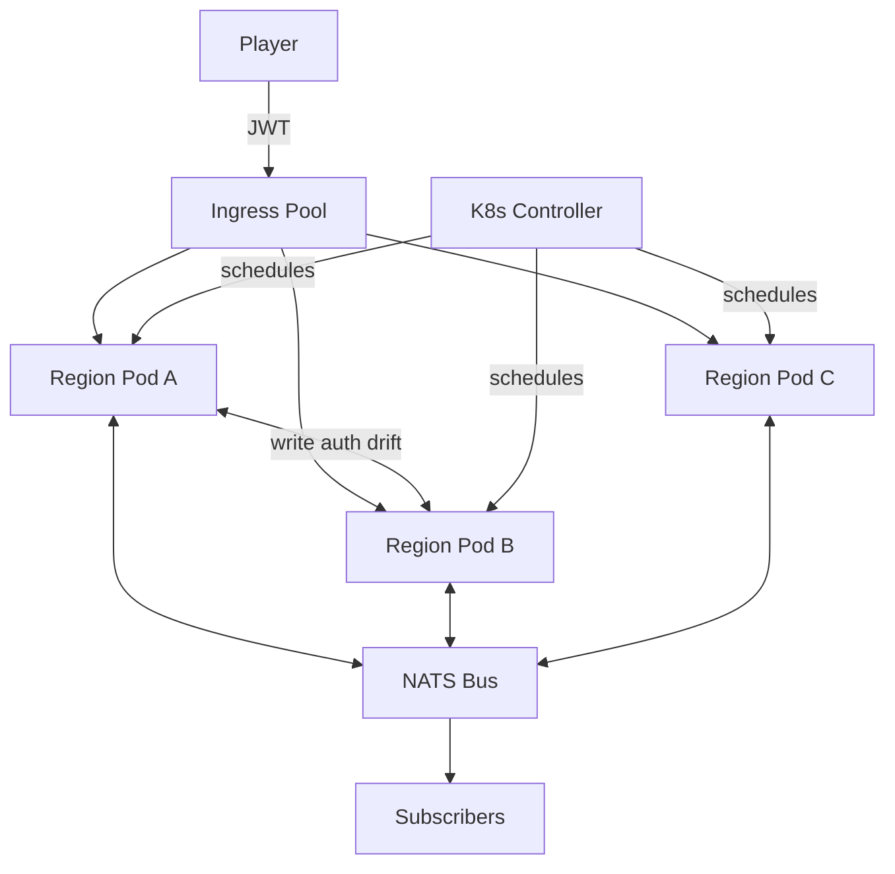

# symc — Distributed MC Sync Engine

[]()
[]()
[]()

> Distributed Minecraft sync engine based on [PaperMC/Paper](https://github.com/PaperMC/Paper) fork.
> Splits the world into regions running on K8s pods, with seamless cross-region player migration.

[中文 README](./README.md) · [Design Doc](./DESIGN.md) · [Decisions](./DECISIONS.md) · [Experiments](./docs/PHASE1-REPORT.md)

---

## What is symc?

symc is a distributed version of Minecraft server that splits the world into **regions**, each running in an independent process (pod). When a player walks across a region boundary, the server transparently migrates their connection without any visible loading screen.

Built on top of [PaperMC/Paper 26.1.2](https://github.com/PaperMC/Paper), symc adds:

- **JWT-based single sign-on** at a K8s-managed ingress pool
- **Per-region write authority** with cold/hot/primary replica states and dual-write transition
- **CooperationRequest protocol** for cross-region events (redstone, water, entities)
- **CompositeEvent causality check** for anti-cheat baseline (OriginRegion + OriginTick + CausalityHash)

## Key Design Decisions

| ID | Decision | Rationale |
|---|---|---|
| **D1** | Weight = `tanh((Urgency × Impact × RegionFactor) × α)` + dual-gate throttling (temperature + AgentLoad) | Replace 8-parameter scalar with structural gating + 3-variable precision |
| **D2** | Single write authority per chunk + cold/hot/primary 3-state replicas + dual-write transition | Avoid hard handoff (50ms player-perceivable) — done in M2 |
| **D3** | Paper 26.1.2 transfer packet (`ClientboundTransferPacket`) | Mojang-native protocol, no client mod, no black-box proxy |
| **D4** | Anti-cheat = baseline (main region authority) + coverage (CompositeEvent causality check) | Two-layer separation: who-decides vs how-detect |
| **D5** | Anvil 1:1 + manifest with `replica_pods` field | Aligns with MC's region file structure, minimal new infra |
| **D-extra** | CooperationRequest = `computation` / `state_query` / `write_authority_transfer` | Single protocol, three request types |

See [DECISIONS.md](./DECISIONS.md) for full discussion history and [DESIGN.md](./DESIGN.md) for detailed architecture.

## Architecture Overview



## Experiments (v0.1 — 7 sims)

| ID | What | Result |
|---|---|---|
| M5.5 | Temperature field sim | 3-factor tanh, hysteresis 0.6/0.4 — formula verified |
| M1 | In-process channel baseline | P99 = 0.56ms (single sender) |
| M1 | Real NATS pub/sub | 64B P99=874μs, **64KB P99=31.9ms (×3.2 over target)** |
| M1 | Redis Streams (miniredis) | 64KB P99=847μs — **8.4× faster than NATS for large msgs** |
| M3 | Read-replica broadcast | 6.7M msgs/s (64 replicas) |
| M4 | Anti-cheat causality hash | 219ns/event (SHA-256 8B truncated) |
| P4 | Buffer zone sim | N=1 optimal: 76% CompositeEvent reduction, +25% cost |
| M8 | End-to-end NATS pub/sub | 100/100 msg, avg RTT 698μs |

→ [Full Phase 1 report](./docs/PHASE1-REPORT.md) · [Per-experiment reports](./docs/)

**M1 conclusion**: Redis Streams recommended over NATS for symc (8.4× faster on large payloads, comparable on small). NATS reserved for JetStream persistence scenarios.

## Paper Fork Status

```
Paper fork branch: dev/symc (4 commits ahead of upstream)
├── M6: 4 symc hooks (write authority / cooperation / anticheat / package-info)
├── M6 v2: self-instanced multi-threaded runtime (4 daemon threads)
├── M7: real network sync via NATS (jnats 2.17.0, pub/sub on symc.cooperation.{regionId})
└── M7 fix: compile errors resolved
```

Build setup:
- JDK 25 (Temurin 25.0.3+9) at `third-party/jdk25/`
- Gradle 9.4.1 (via wrapper, with proxy config in `Paper/gradle.properties`)
- Compile: `cd Paper && . ../.gradle-env.ps1 && ./gradlew.bat :paper-server:compileJava`

See [JDK-PAPER-SETUP.md](./docs/JDK-PAPER-SETUP.md) for full setup.

## Quick Start

### Run the experiments

```bash
# M1 in-process channel baseline
go run ./cmd/exp1-bus

# M1 real NATS (need NATS server running on :4222)
go run ./cmd/exp1-bus-nats

# M4 anti-cheat causality hash
go run ./cmd/exp4-anticheat

# M8 end-to-end NATS pub/sub
go run ./cmd/e2e
```

### Build the Paper fork

```powershell
cd Paper
. ..\.gradle-env.ps1
.\gradlew.bat applyPatches     # ~12 min first time
.\gradlew.bat createPaperclipJar # ~7 min, produces paperclip jar
```

## Repository Structure

```
symc/
├── README.md, README.en.md     # Chinese / English
├── DECISIONS.md, DESIGN.md, WATCHDOG.md  # Design docs
├── docs/                         # 9 experiment reports + Phase 1 summary
├── cmd/                          # Go simulations
│   ├── sim/                      # Entry point
│   ├── exp-tempfield/            # M5.5
│   ├── exp1-bus/                 # M1 in-process
│   ├── exp1-bus-nats/            # M1 NATS
│   ├── exp1-bus-redis/           # M1 Redis (miniredis)
│   ├── exp3-replica/             # M3
│   ├── exp4-anticheat/           # M4
│   ├── exp-bufferzone/           # P4
│   └── e2e/                      # M8 NATS pub/sub e2e
├── pkg/                          # Go packages (cell, layer, weight, sync)
├── data/                         # Raw experiment outputs
├── results/                      # Archived final results
├── Paper/                        # PaperMC/Paper fork (separate git history)
├── third-party/                  # JDK 25, NATS server
└── .gradle-env.ps1               # JAVA_HOME + GRADLE_USER_HOME setup
```

## Status & Roadmap

- ✅ v0.1 (this): Design + 7 experiments + M5/M6/M6v2/M7/M8 on Paper fork
- 🔄 M2: write authority drift dual-write (needs M5 + M7 NATS integration)
- 🔄 M8 real Paper integration: load symc hooks, trigger real MC events
- 📋 K8s controller + CRD definitions (M7+)
- 📋 Buffer zone cost optimization (P4 data)
- 📋 Anti-cheat with real MC player behavior data (M9+)

See [PHASE1-REPORT.md](./docs/PHASE1-REPORT.md) for current status.

## Contributing

This is a research project — all symc code in `cmd/exp*`, `pkg/`, `cmd/e2e/`, and the 4 symc hooks in `Paper/paper-server/src/main/java/io/papermc/paper/symc/` is part of v0.1.

Paper fork patches are applied via paperweight. To contribute Paper-side changes:
```bash
cd Paper
git checkout dev/symc
# modify paper-server/src/minecraft/ or paper-api/
./gradlew.bat fixupSourcePatches
./gradlew.bat rebuildPatches
```

## License

Paper 26.1.2 is GPL-3.0 (see [Paper license](https://github.com/PaperMC/Paper/blob/ver/26.1.2/LICENCE.txt)).
symc hooks are under the same license.

---

*Last updated: 2026-06-20 · v0.1 alpha · 4 commits on `dev/symc` branch*
